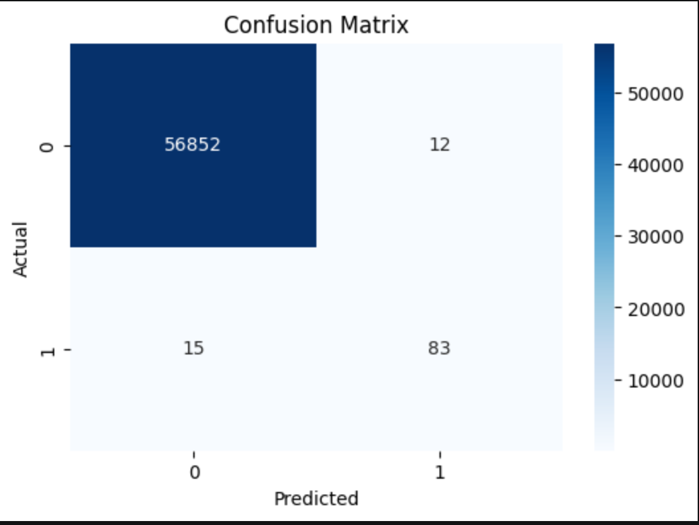
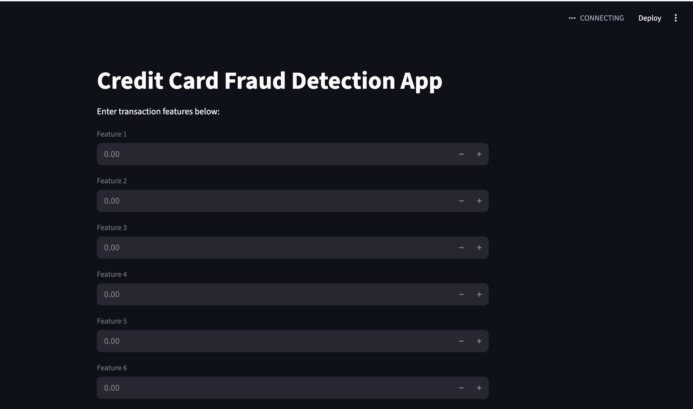

# Credit Card Fraud Detection Using Machine Learning

This project uses machine learning to detect fraudulent credit card transactions. 
The dataset contains highly imbalanced transaction data, where fraud cases are much fewer than normal transactions.

## Objectives
- Explore transaction data
- Handle class imbalance
- Train classification models
- Evaluate fraud detection performance using precision, recall, F1-score, and ROC-AUC

## Models Used
- Logistic Regression
- Random Forest
- Gradient Boosting

## Key Skills Demonstrated
- Data cleaning
- Exploratory data analysis
- Classification
- Imbalanced data handling
- Model evaluation
- Python machine learning workflow


## Streamlit Web App

This project also includes a Streamlit web application for real-time fraud prediction.

### Features
- Interactive transaction feature inputs
- Fraud prediction using trained Random Forest model
- Real-time classification results
- Simple machine learning deployment

  Model Performance

The final Random Forest model achieved strong fraud detection performance after handling class imbalance using SMOTE.

Fraud Detection Model Performance

Precision and recall comparison for the final Random Forest + SMOTE model.






Future Improvements
XGBoost integration
ROC-AUC optimization
Feature importance visualization
Real-time API deployment
Cloud deployment using Streamlit Cloud
Author

Built by Tshego as a machine learning portfolio project focused on fraud analytics and real-time prediction systems.


## Project Structure

```text
fraud-detection-ml/
│
├── app.py
├── README.md
├── requirements.txt
├── .gitignore
│
├── data/
│
├── images/
│
├── models/
│   └── fraud_detection_model.pkl
│
├── notebooks/
│   └── fraud_detection_model.ipynb


